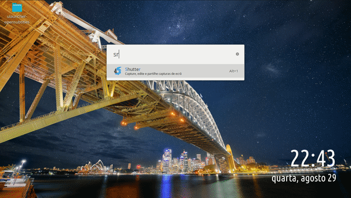

# OpenSubtitles (ULauncher Extension)

This is an extension for [ULauncher](https://ulauncher.io/), a mac-like application launcher for linux. 



For this extension to work, install the following modules:
```
pip install --user beautifulsoup4
```

Available Commands:

`srt ` - Shows you the menu

`srt m %s` - Shows search results for %s in OpenSubtitles

`srt tv %s` - (Same as for 'movie')

`srt -%id` - Show subtitles available for the movie(or tv-show) with the id %id (in the default language, chosen in the preferences)

`srt -%id eng` - Same as above, but with 'eng' (English) as the language of choice for the subtitles

`srt auto` - Shows video files found in the system so that a subtitle can be found for that specific file.


**TODO in the future:**

`srt %query` - Search opensubtitles directly with %query

Credit:
    -> Most icon flags were downloaded from [flaticon](https://www.flaticon.com/packs/rectangular-country-simple-flags?style_id=118&family_id=41&group_id=1&category_id=85)